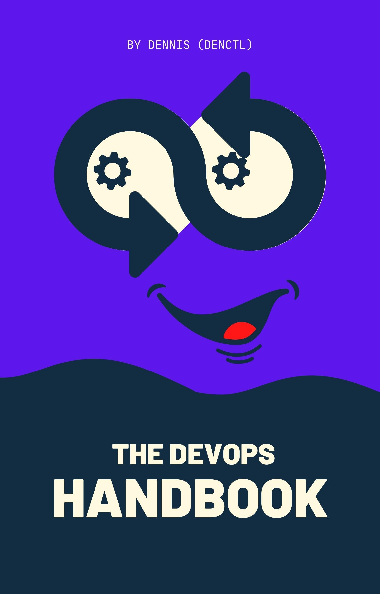

    

	    
	    
	    
	    
	    
    

## 💡 DevOps Handbook

This is an open-source DevOps Handbook that will help you to elevate your general IT knowledge and skills and also help you understand DevOps better.

The guide is suitable for anyone working as a developer, system administrator, or an aspiring DevOps engineer.

## 🚀 Download

To download a copy of the ebook use one of the following links:

* [Dark mode](#)

* [Light mode](#)

## 📘 Chapters

The first section is thoretical and the second section is practical.

Here is the list of theoretical chapters:
* [Chapter 1: Introduction](#)
* [Chapter 2: I am a SysAdmin](#)
* [Chapter 3: I am a Developer](#)
* [Chapter 4: I am almost a DevOps Engineer](#)
* [Chapter 5: DevOps 101](#)
* [Chapter 6: DevOps 102](#)
* [Chapter 7: DevOps 201](#)
* [Chapter 8: DevOps 202](#)
* [Chapter 9: DevOps 203](#)
* [Chapter 10: DevOps 204](#)
* [Chapter 11: DevOps 205](#)
* [Chapter 12: DevOps 206](#)
* [Chapter 13: DevOps 207](#)

Here is the list of practical chapters:
* [Chapter 14: Deploy a DigitalOcean Droplet](#)
* [Chapter 15: Laravel on a DigitalOcean Droplet](#)
* [Chapter 18: Laravel on DigitalOcean Kubernetes(DOKS)](#)
* [Chapter 17: Laravel with DigitalOcean Spaces](#)
* [Chapter 16: Laravel with DigitalOcean Managed Databases](#)
* [Chapter 19: Laravel Automatic Deployment with BASH](#)
* [Chapter 20: Load Balancing with HAProxy](#)
* [Chapter 21: Laravel Migration from one server to another](#)
* [Chapter 22: Laravel with DigitalOcean Load Balancer](#)
... to be continued

## 🌟 Sponsors

This book is made possible thanks to many fantastic Hacktoberfest contributors!

### 💙 DigitalOcean

DigitalOcean is a cloud services platform delivering the simplicity developers love and businesses trust to run production applications at scale.

It provides highly available, secure, and scalable compute, storage, and networking solutions that help developers build great software faster.

Founded in 2012 with offices in New York and Cambridge, MA, DigitalOcean offers transparent and affordable pricing, an elegant user interface, and one of the largest libraries of open source resources available.

For more information, please visit [https://www.digitalocean.com](https://www.digitalocean.com) or follow [@digitalocean](https://twitter.com/digitalocean) on Twitter.

If you are new to DigitalOcean, you can get a free $100 credit and spin up your own servers via this referral link here:

## 👋 About the maintainer

My name is Dennis and by day I am a Senior System Engineer for a Swedish company called [SKF](https://www.skf.com), by the rest of the day I am a contractor at [DigitalOcean](https://www.digitalocean.com), and a Navigator at... you guessed it - [DigitalOcean](https://www.digitalocean.com). I also freelance web development and write blog posts on various topics on the side. Oh, and I won a Hackaton! 🏆

For more information, please visit my blog at [https://denctl.com](https://denctl.com), and follow me on Twitter [@denctl](https://twitter.com/denctl).

In case that you want to support me you can By Me a Coffee here:

## 🔥 PDF Generation Tool

The project uses [Ibis](https://github.com/themsaid/ibis/) developed by [Mohamed Said](https://github.com/themsaid).

Ibis is a PHP tool that helps you write eBooks in markdown.

## 🔗 Links

- [My blog](https://denctl.com)
- [Free $100 Credit For DigitalOcean](https://m.do.co/c/0afa6ab0aa5a)
- [Join DevDojo](https://devdojo.com?ref=dennis)
- [Ibis](https://github.com/themsaid/ibis/)
- [Canva](https://www.canva.com/)

## 🤲 Contributing

If you are contributing 🍿 please read the [contributing file](CONTRIBUTING.md) before submitting your pull requests.
